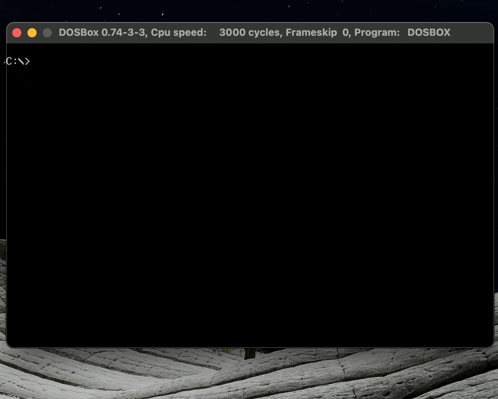

# PEGS

### PEGS is a [_solo noble_ (peg solitaire)](https://en.wikipedia.org/wiki/Peg_solitaire) board game. Written in C by my father, Howard Abrams, in 1991:



## Quickstart

PEGS runs on DOS. You can use [DOSBox](https://www.dosbox.com/) to play the game on any modern machine.

* download DOSBox and run the program. You will see a DOS terminal.
* mount your local directory containing PEGS3.exe:

```bash
mount c: ~/path/to/PEGS
```
* You will see a prompt informing you that the local directory is now mounted as drive `C:`

```bash
Drive C is mounted as local directory ~/path.to/PEGS
```

* change into `C:`:

```bash
c:
```

* Run the program and have fun!

```bash
PEGS3.exe
```
